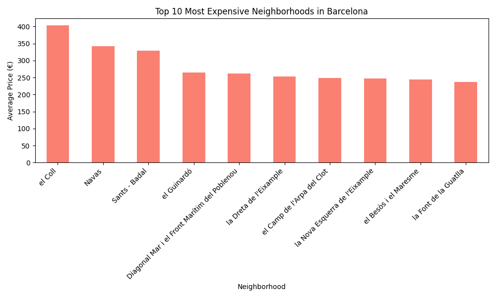

# Barcelona Rental Data Pipeline (ETL)

A modular Python-based ETL pipeline that extracts, transforms, and loads Barcelona Airbnb rental data into a local SQLite database.

## 🚀 Project Overview
This project automates the processing of rental data sourced from **Inside Airbnb**. It focuses on clean code practices and modular architecture, ensuring the data is cleaned, validated, and ready for analytical queries.

## 🛠️ Tech Stack
- **Language:** Python 3.14+
- **Data Handling:** Pandas
- **Storage:** SQLite3
- **Version Control:** Git & GitHub

## 📂 Project Structure
- `data/`: Contains raw CSV source files (ignored by git).
- `src/`: Core logic including `extract.py`, `transform.py`, and `load.py`.
- `main.py`: The orchestrator that runs the full ETL flow.
- `barcelona_rentals.db`: Final structured database.

## ⚙️ How to Run
1. Install dependencies: `pip install pandas`
2. Place the dataset in `data/rentals.csv`.
3. Execute the pipeline:
   ```bash
   python main.py

   ## 📊 Insights
Below is the visualization of the average rental prices across the top 10 neighborhoods in Barcelona, generated automatically by our analysis module:

